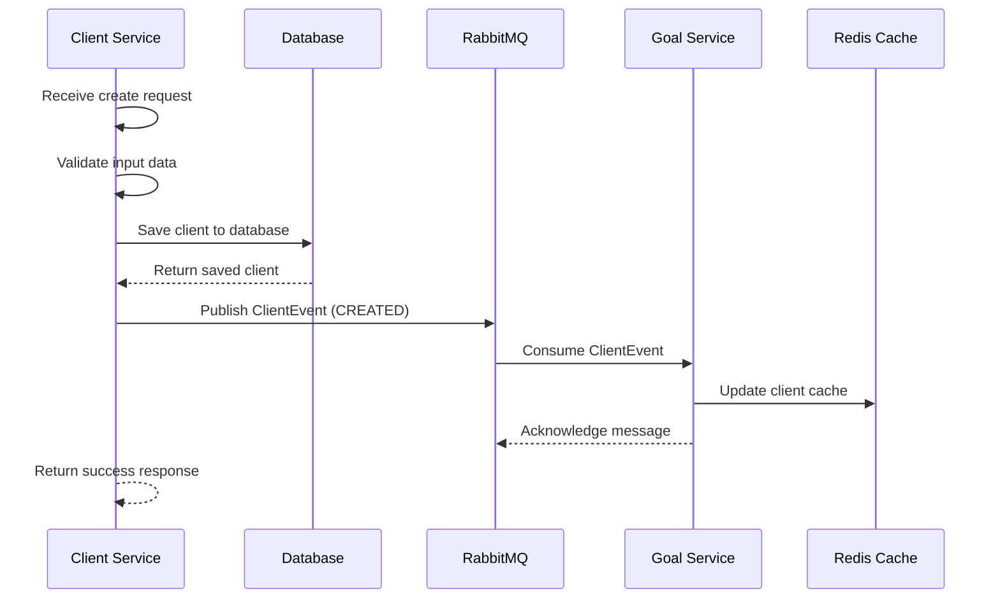
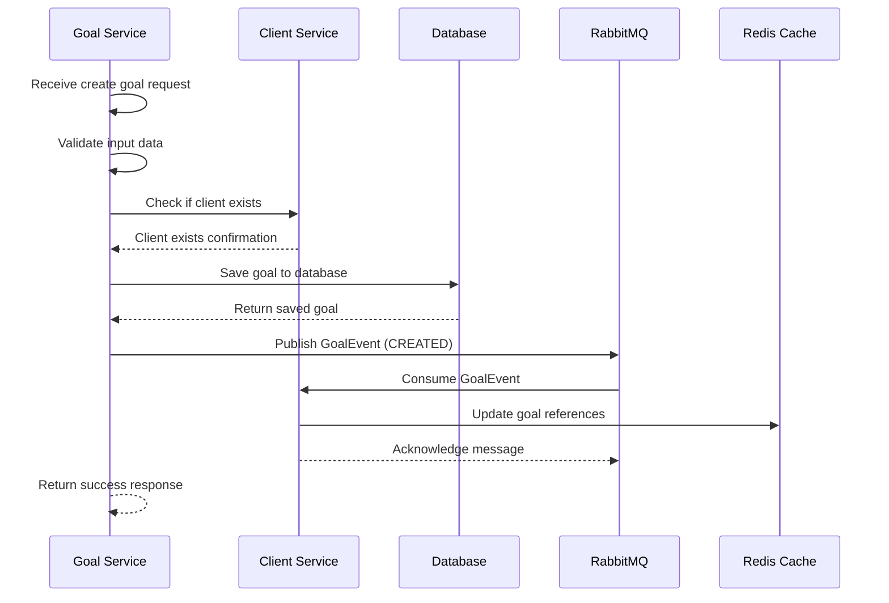
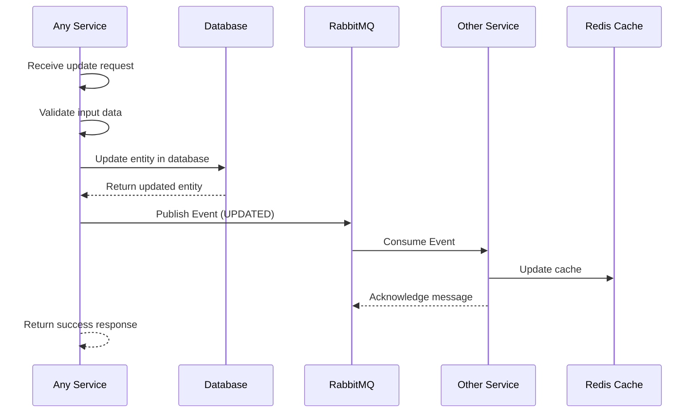
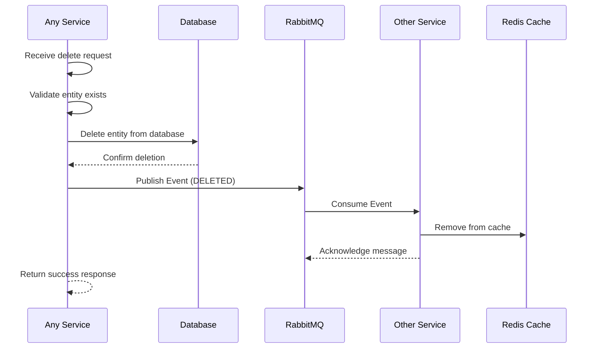

# 🔄 Microservices Communication Flow

## 🌐 **System Overview**

This document describes how the Client Service and Goal Service communicate through events, ensuring loose coupling and scalability.

## 🏗️ **Architecture Diagram**

```
┌─────────────────────────────────────────────────────────────────────────────┐
│                           MICROSERVICES ARCHITECTURE                        │
└─────────────────────────────────────────────────────────────────────────────┘

┌─────────────────┐                    ┌─────────────────┐
│   Client        │                    │   Goal          │
│   Service       │                    │   Service       │
│   (Port 8080)   │                    │   (Port 8081)   │
└─────────────────┘                    └─────────────────┘
         │                                       │
         │                                       │
         │  ┌─────────────────────────────────┐  │
         │  │         RabbitMQ                │  │
         │  │      Message Broker             │  │
         │  │                                 │  │
         │  │  ┌─────────────┐ ┌─────────────┐ │  │
         │  │  │ Client      │ │ Goal        │ │  │
         │  │  │ Events      │ │ Events      │ │  │
         │  │  │ Queue       │ │ Queue       │ │  │
         │  │  └─────────────┘ └─────────────┘ │  │
         │  └─────────────────────────────────┘  │
         │                                       │
         ▼                                       ▼
┌─────────────────┐                    ┌─────────────────┐
│   Redis         │                    │   Redis         │
│   Cache         │                    │   Cache         │
└─────────────────┘                    └─────────────────┘
         │                                       │
         ▼                                       ▼
┌─────────────────┐                    ┌─────────────────┐
│   H2 Database   │                    │   H2 Database   │
│   (In-Memory)   │                    │   (In-Memory)   │
└─────────────────┘                    └─────────────────┘
```

## 🔄 **Event Flow Patterns**

### **1. Client Creation Flow**



**Event Details:**
```json
{
  "clientId": 1,
  "eventType": "CREATED",
  "clientName": "John Doe",
  "clientEmail": "john@example.com",
  "timestamp": "2025-08-26T10:00:00"
}
```

### **2. Goal Creation Flow**



**Event Details:**
```json
{
  "goalId": 1,
  "eventType": "CREATED",
  "clientId": 1,
  "goalName": "Vacation Fund",
  "targetAmount": 5000.00,
  "timestamp": "2025-08-26T10:00:00"
}
```

### **3. Update Flow**



### **4. Delete Flow**



## 📨 **Event Types & Structure**

### **Event Base Structure**
```java
public abstract class BaseEvent {
    private String eventType;        // CREATED, UPDATED, DELETED
    private LocalDateTime timestamp; // Event occurrence time
    private String source;           // Service that generated event
}
```

### **ClientEvent Structure**
```java
public class ClientEvent extends BaseEvent {
    private Long clientId;           // Client identifier
    private String clientName;       // Client name
    private String clientEmail;      // Client email
}
```

### **GoalEvent Structure**
```java
public class GoalEvent extends BaseEvent {
    private Long goalId;             // Goal identifier
    private Long clientId;           // Associated client
    private String goalName;         // Goal name
    private BigDecimal targetAmount; // Target amount
}
```

## 🔧 **Message Queue Configuration**

### **RabbitMQ Setup**
```java
@Configuration
public class RabbitMQConfig {
    
    @Bean
    public Queue clientEventsQueue() {
        return new Queue("client.events", true);
    }
    
    @Bean
    public Queue goalEventsQueue() {
        return new Queue("goal.events", true);
    }
    
    @Bean
    public TopicExchange eventsExchange() {
        return new TopicExchange("microservice.events");
    }
    
    @Bean
    public Binding clientEventsBinding() {
        return BindingBuilder.bind(clientEventsQueue())
                           .to(eventsExchange())
                           .with("client.*");
    }
    
    @Bean
    public Binding goalEventsBinding() {
        return BindingBuilder.bind(goalEventsQueue())
                           .to(eventsExchange())
                           .with("goal.*");
    }
}
```

### **Queue Properties**
- **Durability**: Queues survive broker restarts
- **Auto-delete**: Queues removed when no consumers
- **Message TTL**: Messages expire after 24 hours
- **Dead Letter**: Failed messages sent to DLQ

## 📊 **Event Processing Patterns**

### **1. At-Least-Once Delivery**
- Messages acknowledged after successful processing
- Failed messages retried with exponential backoff
- Dead letter queue for unprocessable messages

### **2. Idempotency**
- Events include unique identifiers
- Services check for duplicate processing
- Database constraints prevent duplicate data

### **3. Event Ordering**
- Events processed in FIFO order within queues
- Critical operations use sequence numbers
- Parallel processing for independent events

## 🚨 **Error Handling & Resilience**

### **Message Processing Errors**
```java
@RabbitListener(queues = "client.events")
public void handleClientEvent(ClientEvent event) {
    try {
        // Process event
        processClientEvent(event);
        // Acknowledge message
    } catch (Exception e) {
        // Log error
        logger.error("Failed to process client event: {}", event, e);
        // Message will be retried
        throw new AmqpRejectAndDontRequeueException(e);
    }
}
```

### **Retry Strategy**
- **Initial delay**: 1 second
- **Multiplier**: 2.0 (exponential backoff)
- **Max attempts**: 3
- **Max delay**: 10 seconds

### **Circuit Breaker Pattern**
- Monitor service health
- Stop sending events to unhealthy services
- Automatic recovery when service becomes healthy

## 📈 **Performance & Monitoring**

### **Metrics to Track**
- **Message throughput**: Events per second
- **Processing latency**: Time to process events
- **Error rates**: Failed event processing
- **Queue depths**: Messages waiting to be processed

### **Health Checks**
```java
@Component
public class RabbitMQHealthIndicator implements HealthIndicator {
    
    @Override
    public Health health() {
        try {
            // Check connection and queues
            return Health.up()
                       .withDetail("queues", getQueueInfo())
                       .build();
        } catch (Exception e) {
            return Health.down()
                       .withException(e)
                       .build();
        }
    }
}
```

## 🔄 **Event Sourcing Considerations**

### **Event Store**
- All events stored in persistent storage
- Event replay capability for recovery
- Audit trail for compliance

### **Snapshot Strategy**
- Periodic snapshots of entity state
- Faster recovery from snapshots
- Incremental replay from last snapshot

## 🚀 **Scaling Strategies**

### **Horizontal Scaling**
- Multiple instances of each service
- Load balancing across instances
- Shared message queues

### **Event Partitioning**
- Partition events by client ID
- Ensure related events processed in order
- Parallel processing for different partitions

---

**This event-driven architecture ensures loose coupling, high scalability, and reliable communication between your microservices!** 🚀
